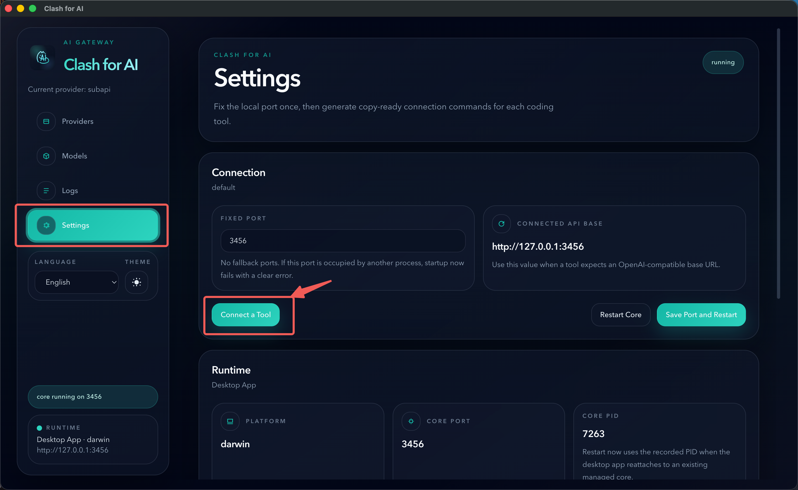

# Clash for AI

Clash for AI 是一个面向多 AI Gateway / 中转 API 使用场景的本地桌面网关工具。

[English README](./README.md)

它提供：

1. 一个稳定的本地统一接入地址
2. 一个可视化的 Provider 切换控制台
3. 本地请求日志和健康检查能力，方便排障

## Screenshot

<p align="center">
  
</p>

<p align="center">
  
</p>

## 这个项目解决了什么问题

Clash for AI 主要面向经常切换不同 AI Gateway / 中转 API 的用户。

它主要解决两个问题：

1. 中转 API 服务不稳定，用户需要在不同中转 API 服务商之间频繁切换
2. 当你同时使用多个编程工具、聊天客户端或脚本时，每次切换服务商都要重复修改配置

Clash for AI 的做法是在你的工具前面放一个本地 Gateway。

你的工具只需要统一接入本地地址一次，之后切换上游 Gateway 时，不再需要逐个修改工具配置，只需要在桌面应用里切换即可。

## 这个项目和 cc-switch 的区别

两者的差异主要在产品定位和接入方式。

| 维度 | cc-switch | Clash for AI |
|---|---|---|
| 公开定位 | 面向 Claude Code、Codex、Gemini CLI、OpenCode、OpenClaw 的一体化桌面管理工具 | 面向多 AI Gateway / 中转 API 的本地桌面网关管理工具 |
| 主要目标 | 管理特定 AI 编程工具里的 Provider 配置 | 在统一本地入口后面切换上游 Gateway |
| 切换方式 | 公开文档重点是围绕已支持工具做 Provider 配置管理和切换 | 工具统一连到本地端口，由桌面应用切换上游 Gateway |
| 对工具配置的影响 | 以特定工具的配置管理流程为中心 | 初次设置 Base URL 后，尽量不再重复改各个工具的配置 |
| 接入范围 | 公开 README 重点覆盖 5 个编程 CLI 及其 MCP / Skills / Prompt 工作流 | 统一本地端点可复用于编程工具、Cherry Studio 这类聊天客户端，以及 SDK / 脚本接入 |
| 当前能力重点 | MCP、Skills、Prompts、Sessions、Proxy / Failover、Cloud Sync 等一体化工具管理能力 | Provider 切换、健康检查、请求日志、稳定本地接入等网关能力 |

一句话概括：cc-switch 更偏向“特定 AI 编程工具管理器”，Clash for AI 更偏向“本地网关 + 中转 API 管理面板”。

## 它是怎么工作的

Clash for AI 会在你的机器上运行一个本地 API Gateway。

你的编辑器、聊天客户端、CLI 工具或自定义脚本先连接本地地址：

```text
http://127.0.0.1:3456/v1
```

然后 Clash for AI 再把请求转发到当前在桌面应用中激活的 Provider。

这意味着：

1. 切换 Provider 时，不需要重新配置每个工具
2. Provider 凭证统一在本地管理
3. 可以直接在桌面界面查看健康状态和请求日志

## 当前能力

1. 基于 Electron 的桌面应用
2. 基于 Go 的本地转发网关
3. Provider 管理
4. 当前生效 Provider 切换
5. 健康检查
6. 请求日志
7. 默认端口被占用时自动选择可用本地端口
8. 打包版本内置更新流程

## 如何使用

查看用户使用文档：

- [使用教程](./docs/user-guide.md)
- [English README](./README.md)

### 第一步：在 Clash for AI 中添加中转 API 服务

打开桌面应用中的 `Providers` 页面，填写：

1. `Name`
2. `Base URL`
3. `API Key`

对于 OpenAI 兼容中转服务，通常推荐填写带 `/v1` 的 Base URL。

<p align="center">
  
</p>

### 第二步：在工具中填写接入参数

大多数支持 OpenAI-compatible 接口的工具都可以这样配置：

```text
Base URL: http://127.0.0.1:3456/v1
API Key: dummy
```

如果运行时使用的不是 `3456`，请以桌面应用里显示的 `connected api base` 为准。

### 第三步：打开 `Tools` 页面完成工具接入

添加好 Provider 以后，打开桌面应用中的 `Tools` 页面。

`Tools` 现在是连接编程工具的主入口，它会提供：

1. 可直接使用的桌面工具 / 编辑器插件接入参数
2. 对 Codex CLI、Claude Code 这类 CLI 工具的一键配置能力
3. 对 Cherry Studio、Cursor、SDK 脚本等工具的专用接入引导

对于 CLI 工具，Clash for AI 可以直接写入本地网关配置。

对于桌面工具，`Tools` 会展示需要填写的 Base URL 和 API Key 字段；对于 Cherry Studio，还可以尝试直接通过导入链接唤起应用。

## 快速接入

如果你暂时不想先看完整使用手册，可以先按下面两种方式快速接入。

### CLI 工具

对于 Codex CLI 这类 OpenAI 兼容 CLI，先在当前 shell 中设置环境变量，再启动工具：

```bash
export OPENAI_BASE_URL="http://127.0.0.1:3456/v1"
export OPENAI_API_KEY="dummy"
```

然后在同一个终端会话里启动 CLI。

对于 Claude Code 这类 Anthropic 风格工具，请使用不带 `/v1` 的本地根地址：

```bash
export ANTHROPIC_BASE_URL="http://127.0.0.1:3456"
export ANTHROPIC_AUTH_TOKEN="dummy"
```

在 Clash for AI 中，你也可以直接打开 `Tools` 页面，使用对已支持 CLI 的一键接入流程。

### IDE / 插件 / 桌面客户端

对于 IDE、编辑器插件和桌面聊天客户端，打开它们的 Provider 配置页面并填写：

```text
Base URL: http://127.0.0.1:3456/v1
API Key: dummy
```

在 Clash for AI 里，你也可以进入 `Tools` 页面查看这些已整理好的接入参数。

<p align="center">
  
</p>

<p align="center">
  
</p>

如果工具像 Cursor 或 Cherry Studio 一样还要求选择 Provider Type / Protocol，请优先选择 OpenAI-compatible 自定义 Provider 模式，再填写上面的参数。

对于 Cursor，可以进入它的自定义 Provider 配置界面，选择 OpenAI-compatible 模式，然后填写本地 Base URL 和 `dummy` API Key。

<p align="center">
  
</p>

### SDK 脚本 / 本地应用

如果你希望在自己的脚本里，通过 Clash for AI 和当前激活的 Provider 交互，只需要把 SDK 或 HTTP 请求指向本地网关，而不是直接请求上游中转服务。

使用 OpenAI SDK 的示例：

```ts
import OpenAI from "openai";

const client = new OpenAI({
  apiKey: "dummy",
  baseURL: "http://127.0.0.1:3456/v1"
});

const response = await client.responses.create({
  model: "gpt-4.1",
  input: "Say hello from Clash for AI."
});

console.log(response.output_text);
```

也可以直接使用 HTTP 请求：

```bash
curl http://127.0.0.1:3456/v1/chat/completions \
  -H "Content-Type: application/json" \
  -H "Authorization: Bearer dummy" \
  -d '{
    "model": "gpt-4.1",
    "messages": [
      { "role": "user", "content": "Say hello from Clash for AI." }
    ]
  }'
```

最终由哪个模型实际响应，仍然取决于你的脚本发送的模型名，以及桌面应用里当前激活的是哪个 Provider。

## 本地开发

要求：

1. Node.js
2. pnpm
3. 如果要本地构建核心服务，还需要 Go toolchain

安装依赖：

```bash
pnpm install
```

启动桌面应用开发模式：

```bash
pnpm dev
```

构建桌面应用：

```bash
pnpm build
```

构建各平台安装包：

```bash
pnpm --filter desktop build:mac
pnpm --filter desktop build:win
pnpm --filter desktop build:linux
```

## 项目结构

```text
apps/desktop   Electron 桌面应用
core/          Go 本地网关与 Provider 管理后端
docs/          面向用户的公开文档
```

## License

本项目使用 GNU Affero General Public License v3.0 only。

详见：

- [LICENSE](./LICENSE)

## Brand Notice

本仓库源码采用 AGPL-3.0-only 授权，但以下内容并不默认随源码授权一起开放使用：

1. 项目名称 `Clash for AI`
2. Logo
3. Icon
4. 其他品牌资产

## 状态

项目仍在持续开发中，接口、打包流程和更新行为后续仍可能调整。
